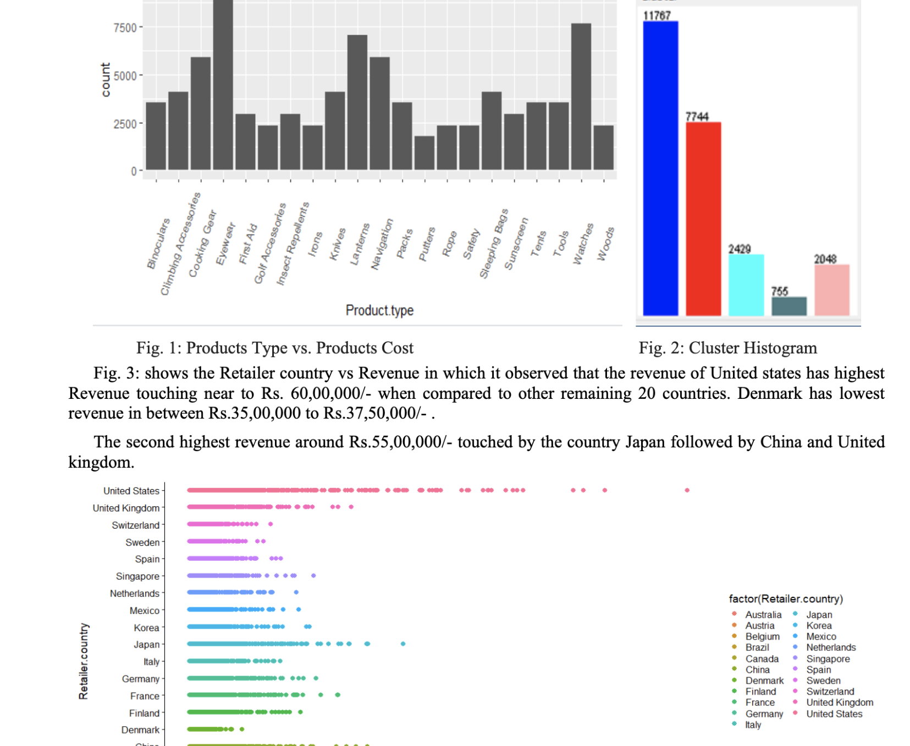

### Hi! Akash here. 🦉

I'm a CS grad student specializing in Artificial Intelligence at Northwestern University. My primary interest lies in expanding my repertoire to galvanize decision strategy and generate actionable insights. 

I bring deep technical expertise & hands-on experience in Data Science & Analytics, Software Development, DL and NLP; having explored specialized projects across various domains. I've collaborated with some of the leading researchers, professionals and various clientele in past few years to deliver highly tailored data-driven solutions, bridging the gap from research to effective real-world deployment. 

In short, I've worked as a Data Scientist, Software/ML Engineer. To know more, check out my page **[here](https://gvsakash.github.io)**. 

I'm best reached via [email](mailto:gvsakash@u.northwestern.edu) or on [LinkedIn](https://linkedin.com/in/gvsakash). Always open for interesting chats and collaboration!
<!--
##### News & Updates: 
* 💻 Expanded on my Spring research with [The Home Depot](https://corporate.homedepot.com) as a ***Data Scientist** (Capstone) to work on Applied DL modules with the product analytics team.* 
* 🏢 My prior internships & work include [NU Retail AI Lab)](https://rac.medill.northwestern.edu/rac-ai-lab/), [Thomson Reuters Labs](https://innovation.thomsonreuters.com/en/labs.html), [IIT Hyderabad](https://github.com/gvsakash/ann-design), [L&T](https://www.kobelco.co.jp/english/welding/) and [TCS](https://cloud.google.com/dialogflow/docs/).
* 🤔 Most of my recent work has gravitated on Tech/Product Analytics, A/B Testing (DOE/Model Agnostic Methods), Deep Learning and Model Deployment. I have a background of diverse work across Analytics (data/retail) and Robotics prior to Tech.
* 🏐 In my spare time, I explore various Art [styles](https://www.instagram.com/gvsakash), Cooking, Volleyball and read Science Novels / Manga.  
-->
 

<!--
**gvsakash/gvsakash** is a ✨ _special_ ✨ repository because its `README.md` (this file) appears on your GitHub profile.

!-->
